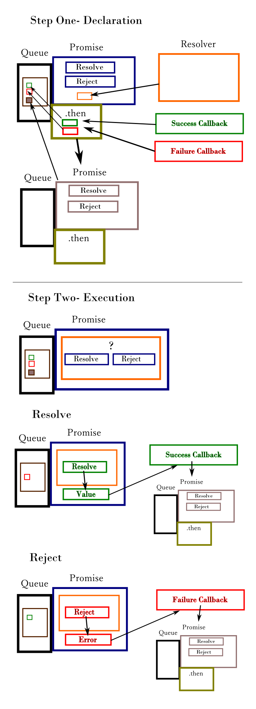

# Broken Promises (And how to fix them)
### Beau Davenport, Mar 9, 2016

---
## What is a promise?

According to the __[Promises A+ Specification](https://promisesaplus.com/)__:

    A promise represents the eventual result of an asynchronous operation.

    The primary way of interacting with a promise is through its then method,

    which registers callbacks to receive either a promise’s eventual value or

    the reason why the promise cannot be fulfilled.

Conceptually, a promise implementation is the asynchronous equivalent of a ```try/catch```:

```javascript
try {
  var data = getSomeData();
  console.log(data);
} catch(ex) {
  console.log(ex);
}
```

The promise equivalent allows the same data and error handling, when the asynchronous task completes.

```javascript
getSomeData.then(function(data) {
  console.log(data);
}, function(ex) {
  console.log(ex);
});
```


### _Why_ are they used?

- DB Queries
- Web Requests
- User Interaction
- Many other asynchronous tasks

### _Where_ are they used?

- DB Frameworks like __[CouchDB](http://pouchdb.com/)__
- HTTP Request libraries like __[Axios](https://github.com/mzabriskie/axios)__
- Front-end frameworks like __[Ember](http://emberjs.com/)__

## Anatomy of a promise



### Resolver
The first step in the implementation of a promise is a "Resolver" function. This is a function that is provided 2 callback parameters by the promise constructor, and contains business logic around which of those two methods to call and when. When the resolver calls either function, it will do so with a value. Including the promise constructor, a resolver will look like:

```javascript
var promise = new Promise(function(resolve, reject) {
  if(randomValue === 1) {
    resolve(randomValue);
  } else {
    reject(randomValue);
  }
});
```

This function gets to decide if a promise is _resolved_ (success!) or _rejected_ (failure!).  If you're using a promise-based library, the resolver is often already implemented.  If you're creating your own promise from scratch, this will be the first step.

### .then
After the resolver is defined, it's all about ```.then```! Unlike the resolver, this method will be exposed by a promise-based library and is your main interface with the promise.

This method has a few major responsibilities:
1. Creates a new promise instance
2. Registers a success callback (should be the first argument)
3. Registers a failure callback (should be the second argument)
4. Returns a reference to the new Promise

The Resolver will determine whether to reject or resolve the promise. If resolved, the promise will have its value set to whatever ```resolve()``` is called with, then execute the enqueued success callbacks. The internal promises associated with those "queue items" will be resolved with the return value, OR take on the state of the promise returned (if an actual promise is returned instead of a value.) This process will continue _ad infinitum_ until the chain is complete.

 The same thing will happen if the ```reject()``` is called, but the _failure_ callbacks will be executed instead.

__Note__: failure callbacks can __totally__ return a new successful promise or value! You could start a whole new chain.

## Examples
This presentation will examine 9 broken promises, how to fix them, and a takeaway lesson for each.

### Our implementation
For our examples, we'll be using 3 http requests wrapped in a promise implementation.

## Broken Promise One - Assumed synchronicity

<br /><br/>


<br /><br/><br /><br/>

### Lesson: Promises don't block code execution.
<br /><br/>

---

## Broken Promise Two -  Unexpected return value
<br /><br/>


<br /><br/><br /><br/>

### Lesson: Promises Don't return a value. They return a new promise.
<br/><br/>

---

## Broken Promise Three -  Chaining without returning a value
<br /><br/>


<br /><br/><br /><br/>

### Lesson: A success or failure callback must return a value if you want access to it down the chain.
<br/><br/>

---

## Broken Promise Four -   Forgetting to provide a failure callback (or .catch)
<br /><br/>


<br /><br/><br /><br/>

### Lesson: If a promise rejects, and there is no failure callback, it will fail silently.
<br/><br/>

---

## Broken Promise Five -   Using a named function as a callback but forgetting about the arguments

<br /><br/>


<br /><br/><br /><br/>

### Lesson: A success callback is always called with a value as the first argument.
<br/><br/>

---

## Broken Promise Six -  calling a new promise in a callback but forgetting to return it

<br /><br/>


<br /><br/><br /><br/>

### Lesson: You can return a new promise from inside a success callback, and start your chain from there - your next success or failure callbacks will be called based on THAT promise - but only if you return it!
<br/><br/>

---

## Broken Promise Seven -  THE PYRAMID OF DOOM
<br /><br/>


<br /><br/><br /><br/>

### Lesson: Promises aren't anonymous callbacks! Every ```.then``` method returns a promise reference you can use. Remember to return, then chain!
<br/><br/>

---

## Broken Promise Eight -  A chain without a catch
## And 8.5 - A chain with a throw without a catch
<br /><br/>


<br /><br/><br /><br/>

### Lesson: Failures and thrown errors are swallowed (and rejected promise state is passed along) until a failure callback is found.
<br/><br/>

---

## Broken Promise Nine -  How do I pass along my data?
<br /><br/>


<br /><br/><br /><br/>

### Lesson: Variables in scope can be used in multiple callbacks, and values can be put into objects that can be passed down the chain
<br/><br/>

---

---
## Conclusion
